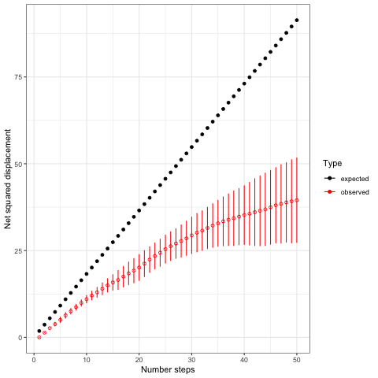

# Reusable Building Block (RBB)

## 1. Name of the RBB

Correlated Random Walk (CRW) to describe agent’s (e.g. animals or humans) movement in homogeneous landscapes


## 2. Authors names and affiliations

Viktoriia Radchuk, _Department of Ecological dynamics, Leibniz Institute for Zoo and Wildlife Research_     
Thibault Fronville, _Department of Ecological dynamics, Leibniz Institute for Zoo and Wildlife Research_        
Uta Berger, _Institute of Forest Growth and Computer Sciences, TU Dresden_   

## 3. Keywords 

movement, animals, local movement, foraging  


## 4. Purpose

The goal of CRW is to represent the movement of animal individuals, in two-dimensional space. When modeled as correlated random walk, the direction of movement at any time step is correlated with the direction of movement at the previous time step. 


## 5. Concepts

The key concept that CRW is based on is that of movement. Movement is defined as a change in the spatial location of an individual over time and is a key behavioural process that shapes ecological and evolutionary processes of nearly all animals [^Nathan2008]. By affecting spatial position of individuals, movement shapes spatial patterns of individuals within populations and thereby affects metapopulation dynamics [^Hanski1994], species distribution [^Hodgson2022] and, more generally, biodiversity dynamics [^Jeltsch2013].     
Different types of movement can be differentiated [^Schlaegel2020] and CRW is useful for describing movement when focusing on local temporal and spatial scales.  

## 6. An overview of the RBB and its use 

- Entity

    - __What entity, or entities, are running the submodel or are involved (e.g., by providing information)? What state variables does the entity need to have to run this RBB?__     
    The entities that call CRW are individual animals. Each individual possesses two state variables: move length and turning angle. These state variables are updated at each time step.


- Context, model parameters & patterns: 
    - __What global variables (e.g., parameters characterising the environment) or data structures (e.g., a gridded spatial environment) does the use of the RBB require?__    
    The RBB requires the current x and y coordinates of the calling agent, and the values of the parameters describing the distributions from which the turning angle and the move length will be drawn.   
    - __Does the RBB directly affect global variables or data structures?__  
    No, RBB does not modify global variables, only the state variables (i.e. x and y coordinates) of the individual are affected.  
    - __What parameters does the RBB use? Preferably a table including parameter name, meaning, default value, range, and unit (if applicable).__  
    Move length is typically chosen from lognormal distribution, so that parameters defining this distribution are needed.    

| name | meaning | units | typical ranges | 
| -------- | -------- | -------- | -------- | 
| mu     | Mean of the lognormal distribution, from which the move length is drawn | meters | ($-\infty$, $\infty$)|
| sd     | Standard deviation of the lognormal distribution, from which the move length is drawn | meters |  (0, $\infty$)|

Turning angles are drawn from appropriate distributions. We present here two ways to model turning angles:
- implementation #1: chosen from uniform distribution    
This is a rather simple and very often used implementation for choosing the turning angle. The angle is drawn from a uniform distribution within a specified range of possible headings (e.g. between -30 and +30 degrees).
- implementation #2: drawn from a von Mises distribution   
A common but more sophisticated solution is the drawing of the turning angle from one kind of a circular distribution, e.g., from a von Mises distribution, wrapped Cauchy distribution, or wrapped normal distribution (Codling et al. 2008). Our second implementation example uses a von Mises distribution. The description of this distribution also requires two parameters namely a mean (m) and a concentration (K).

__Parameters for turning angles according to implementation #1__
| name | meaning | units | typical ranges | 
| -------- | -------- | -------- | -------- | 
| angle     | +/- values of turn | radians | [0, $2\times\pi$] |


__Parameters for turning angles according to implementation #2__
| name | meaning | units | typical ranges | 
| -------- | -------- | -------- | -------- | 
| m     | Mean of the von Mises distribution, from which the turning angle is drawn | radians |  [0, $2\times\pi$] |
| K     | Concentration parameter of the von Mises distribution, used for drawing the turning angles | unitless  | (0, $\infty$) |


- Patterns and data to determine  parameters and/or to claim that the RBB is realistic enough for its purpose:
    - __Which of the variables (or parameters) can be set independent of the model/RBB, using direct measurement, other models (e.g. regression) , etc.?__
    If following implementation #2, all parameters can be estimated by analysing the movement data collected on a sample of individuals of the studied species, e.g. by means of GPS, telemetry or ATLAS (Advanced Tracking and Localization of Animals in real-life Systems).  
    If following implementation #1 the parameters describing the range from which the turning angles are to be drawn may be specified directly by the user, but that would not necessarily reflect movement ecology of the species in consideration.  
    
    - __Which variables or parameters can only be estimated within the context of the model or require calibration?__
    If following implementation #1, the range of the headings out of which to draw the turning angle has to be calibrated.    
    For implementation #2, on contrary, all parameters can be parameterised using empirical data, no calibration is required. 

    - __Which data or patterns can be used for calibration?__   
    Spatial movement data can be used for calibration. These data can be collected in various ways, e.g. by using GPS, telemetry or ATLAS (Advanced Tracking and Localization of Animals in real-life Systems). A pattern that can be used to calibrate the range of headings for implementation #1, for example, is a spatial point pattern of the location of a sample of individuals at a time points separated by longer periods (compared to the time step of the model).     
    
    - __Are pre-existing datasets available to users already exist (references)?__
    CRW was already applied to several species previously and the data to derive the CRW parameters exist for a large number of species that were tracked by means of telemetry. Examples of data collected for modelling the animal movement as CRW:
    
    1. Schtickzelle, N., Joiris, A., van Dyck, H., & Baguette, M. (2007). Quantitative analysis of changes in movement behaviour within and outside habitat in a specialist butterfly. BMC Evolutionary Biology, 7. https://doi.org/4 10.1186/1471-2148-7-4
    2. Root, R. B., & Kareiva, P. M. (1984). The search for resources by cabbage butterflies (Pieris rapae): ecological consequences and adaptive significance of Markovian movements in a patchy environment. Ecology, 65(1), 147–165. https://doi.org/10.2307/1939467


- Interface - A list of all inputs and outputs of the RBB

    - __Which input variables that the RBB requires from an external, calling entity and in which units?__
    If RBB were called by an external entity, then that entity should specify as inputs the parameters for distributions from which the move length and turning angle will be drawm.   
    - __What specific outputs does it produce and how does this update the state variables of the calling entity?__   
    The RBB produces the coordinates (x and y) of the next location to which the entity will be moving. These state variables of the calling entity are then accordingly updated.   

- Scales
Both the temporal and spatial scales are defined by the biology of the species in consideration and are best chosen based on the empirical movement data collected on a sample of individuals, e.g. by means of telemetry or GPS tracking. More generally CRW usually describes local movements of individuals as opposed to the movement types that occur at larger spatial scales, such as dispersal and migration.   

## 7. Pseudocode, a Flowchart or other type of graphical representation
We do not provide a pseudocode as we consider this building block being simple enough to be replicated following the verbal description and the codes we provide in NetLogo, Python and Java

## 8. Programme code

### NetLogo Implementation
NetLogo version 6.2.2 run on MacOS Ventura 13.3.1
Attention, commenting in the below-block is done with '#', when copy-pasting to NetLogo replace with ';'

``` NetLogo
to move

  if any? turtles
    [
      ask turtles
        [
            # assigning the x and y coordinate to the current ones
            set xc xcor
            set yc ycor
            # updating the heading by adding the turning angle drawn from 
            # either a equal distribution or from a von Mises distribution 
            #(see procedures calc_turnangle_equal or calc_turnangle_circ
            ifelse angle_distribution = uniform [set turnangle calc_turnangle_equal]
                                              [set turnangle calc_turnangle_circ]
           
            set heading heading + turnangle
            # drawing the move length
            set moveleng exp (random-normal mu sd)
            # setting the new coordinates with a given move length and turning angle
            set xc xc + (moveleng * (sin heading))
            set yc yc + (moveleng * (cos heading))
            # moving to new coordinates
            setxy xc yc
           
          ]
      ]
end

to-report calc_turnangle_equal
# turning angle - implementation #1: equal distribution
 let turndegrees (random (angle + 1)) - (angle / 2)  
 report turndegrees
end

to-report calc_turnangle_circ
  # turning angle - implementation #2: circular distribution
  # simulation algorithm for von Mises distribution (Fisher p. 49)
  let a (1 + sqrt( 1 + 4 * K ^ 2))
  let b (a - sqrt( 2 * a)) / ( 2 * K )
  let r ( 1 + b ^ 2) / ( 2 * b )
  let turnang 0
  let step4 0
  while [step4 = 0]
    [
      # step 1 of the algorithm
      let U1 random-float 1
      let z (cos ((pi * U1 ) * 180 / pi))  #  should be transformed into degrees for Netlogo cos acos etc
      let f (1 + r * z) / ( r + z )
      let c (K * (r - f))

      # step 2 of the algorithm
      let U2 random-float 1

      ifelse
        ( c * ( 2 - c) - U2) > 0
        [
          # in this case cond 2 is satisfied
          let U3 random-float 1
          if ( U3 - 0.5 ) < 0
          [
            set turnang ((- acos (f) * pi / 180) + m)
          ]
          if ( U3 - 0.5) > 0
          [
            set turnang (acos (f) * pi / 180 ) + m
          ]
          if is-number? turnang [ set step4 1]
        ] 
        # otherwise, if cond 2 is not satisfied
        [
          if  ((ln ( c / U2 )) + 1 - c)  >= 0
          [
            let U3 random-float 1
            if ( U3 - 0.5 ) < 0
                [
                  set turnang ((- acos (f)  * pi / 180) + m)
                ]
            if ( U3 - 0.5) > 0
                [
                  set turnang (acos (f) * pi / 180) + m
                ]
            if is-number? turnang [set step4 1]
          ]
        ]
    ]

  # transforming the turnang to keep within the +-2*pi
  if turnang < 0 [set turnang turnang + 2 * pi]
  if turnang > ( 2 * pi) [set turnang turnang - 2 * pi]
  # transforming the turning angle into degrees
  let turndegrees turnang * (180 / pi)
  report turndegrees
end
```

### Python Implementation

Python version 3.10 run on Pycharm 2021.2.3
Modules needed to run this code are pygame, numpy and matplotlib
``` Python
# required modules
import pygame
import numpy as np
import matplotlib.pyplot as plt

# define von Mises parameter : κ (kappa) 
vonmises_dispersion = 10

# define a object-oriented class 
class Corr_Random_Walker:
    def __init__(self, x, y):

        self.position = pygame.Vector2(x,y)
        # define a vector with a euclidean distance of 1 in a random direction
        vec = np.array([1 * np.cos(np.random.randint(0, 360, 1)), 1 * np.sin(np.random.randint(0, 360, 1))])
        # velocity is defined as a vector for the next movement
        self.velocity = pygame.Vector2(*vec)
        self.random_von_mises_value = float(np.degrees(np.random.vonmises(0, vonmises_dispersion, 1)))

    def define_new_velocity(self):
        
        # defines random angle withtin the von Mises distribution bounderies
        self.random_von_mises_value = float(np.degrees(np.random.vonmises(0, vonmises_dispersion, 1)))
        self.velocity = self.velocity.rotate(self.random_von_mises_value)

    def move(self):
        # adding the velocity to the current position results in a displacement
        self.position += self.velocity


Agents = Corr_Random_Walker( x= 0, y = 0)

X_Coordinates = []
Y_Coordinates = []
for i in range(1000):
    Agents.define_new_velocity()
    Agents.move()
    X_Coordinates.append(Agents.position.x)
    Y_Coordinates.append(Agents.position.y)

plt.plot(X_Coordinates, Y_Coordinates)
plt.legend()
plt.show()
```
### Javascript Implementation

JavaScript on Visual studio code version 1.66
The JavaScript library p5.js is necessary to run this code
``` Javascript
// "von Mises" Implementation following instructions from DOI: https://doi.org/10.1017/CBO9780511564345.005

function  random_von_Mises(mu, kappa){
  if (typeof mu !== "number") {
      return console.log("mu must be number");
  }
  
  if (typeof kappa !== "number") {
      return console.log("kappa must be number");
  }
  
  if (kappa < 0) {
      return console.log("kappa must be positive"); 
  }
  
  if (kappa == 0) {
      return rad_angle = 2.0*Math.PI * (Math.random() -0.5);  
      // number between -pi and +pi
  }

  a = 1.0 + Math.sqrt(1.0 + 4.0*(kappa ** 2));
  b = (a - Math.sqrt(2.0 * a)) / (2.0 * kappa);
  r = (1.0 + b ** 2) / (2.0 * b);

  n = 0;
  rad_angle = 0;
  
  while (n == 0) {

      U1 = Math.random();
      U2 = Math.random();
      U3 = Math.random();

      z = Math.cos(Math.PI * U1);
      f = (1.0 + r * z) / (r + z);
      c = kappa * (r - f);


      if (((c * (2.0 - c) - U2) > 0.0) || ((Math.log(c / U2) + 1.0 - c) > 0.0)){
          rad_angle = (Math.sign(U3 - 0.5) * Math.acos(f) + mu) % (2 * Math.PI)
          n += 1;
          
      }
          
      
    }
  return rad_angle;
}


// CRW Model ---------------------------------------------------------------

// init variables

var mu_var = 0;
var kappa_var = 15;
var init_pos_x = 2000/2;
var init_pos_y = 2000/2;
var step = 0;


// class CRW

class CRW {
  constructor(x,y){
    this.position = createVector(x,y);
    this.velocity = p5.Vector.random2D();
    this.von_mises = random_von_Mises(mu_var, kappa_var);
  }

  define_velocity(){
    this.von_mises = random_von_Mises(mu_var, kappa_var);
    this.velocity.rotate(this.von_mises);
  }

  move() {
    this.position.add(this.velocity);
  }

  show(){
    strokeWeight(10);
    stroke(255, 0, 0);
    point(this.position.x, this.position.y);

  }
}

//  draw

const Agent = []

function setup() {
  createCanvas(2000, 2000);
  for (let i = 0; i<2; i++){
  Agent.push(new CRW(init_pos_x, init_pos_y));
  }
}

function draw() {
  background(51);
  for (let individual of Agent) {
    individual.define_velocity();
    individual.move();
    individual.show();
    
  }
}

```

## 9.	Example analyses of a simulation output, test cases and benchmarks
One prominent test that is usually performed to assess the appropriateness of the CRW model for the empirically collected movement data is based on the net squared displacement [^Turchin1998]. Generally, the net squared displacement grows linearly with the number of moves, and this fact can be used to assess whether the data can be described with CRW. Specifically, one plots the expected net squared displacement (calculated using known formulas, see p. 139 in [^Turchin1998]) vs the number of moves and compares the expected net squared displacement to the one observed from the data for each number of moves. This test can be performed not only with the empirically collected data but also with the simulated data.    

We here confronted the expected net squared displacement (calculated using the formula 5.2 in [^Turchin1998] because the turning angles were approximately symmetrically distributed) with the observed ones for both implementations of CRW: 1) the one based on drawing the turning angles from the uniform distribution (drawn with same likelihood from the range between +5 and -5 degrees), and 2) the other one based on von Mises distribution (with `m` = -0.02 and `K` = 7). Move lengths were drawn from lognormal distribution with the `mu`= 0.3 and sd = 0.05. We run the model with 10 individuals (i.e. producing 10 paths) for 50 time steps.     

<p style="text-align:center;">

</p>
<p style = "font-size: 80%;text-align:center;">Figure 1. Comparison of expected and observed net squared displacement using the CRW implementation based on the uniform distribution of turning angles</p>

<p style="text-align:center;">

</p>
<p style = "font-size: 80%; text-align:center;">Figure 2. Comparison of expected and observed net squared displacement using the CRW implementation based on drawing the turning angles from von Mises distribution</p>

Both parameterisations (Fig. 1 and Fig.2) produce observed net squared displacements that are slighly smaller than those expected under CRW (see figure below). This means that the individuals are not moving as far as would be expected under CRW. The reason for this may be the specific chosen parameterisation. However, we point out that we only inspect the results visually and do not test for the significance of the difference between observed and expected net squared displacements. That can be peformed using bootstrap, for example, as suggested by [^Turchin1998], p. 140-141. 


## 10. Version control  

- Published date: 9.05.2023
- Last updated: 18.12.2023   


## 11. Status Info

- Peer Review: The RBB implementation in NetLogo has been peer-reviewed, the RBB implementations in python and Java have not been peer-reviewed.
- License: GPL-3.0.   

## 12. Citation of the RBB
Viktoriia Radchuk, Thibault Fronville, Uta Berger (2023) ‘Reusable Building Block for Correlated Random Walk (CRW) to model agent's movement in homogeneous landscapes’   


## 13.	Example implementation of the RBB 

An example of implementation of the CRW in NetLogo can be found at: https://www.comses.net/codebases/ea80d735-a536-4616-9df8-6a05a167ec24/releases/1.0.0/ 
The implementation in python: https://www.comses.net/codebases/a33c5f0a-a903-45e0-ae72-cb7abbce2f9f/releases/1.1.0/   
The implementation in Java:   https://www.comses.net/codebases/624ce046-b206-4b54-8a4a-2738cd62b0c6/releases/1.0.0/  

## 14. Use history

CRW was originally developed for describing the movement of insects (e.g. [^Kareiva&Schigesada1983], [^Turchin1998]) and fitted to observational movement data. It has been shown that CRW describes well the movement behaviour not only of insects (e.g. [^Schtickzelle2007], [^Schultz&Crone2001]) but also other animals, e.g. sea stars [^Lohmann2016], caribou [^Bergman2000], and grey seals [^Austin2004]. Accordingly, CRW is often used to represent animal movement in agent-based models (e.g. butterflies: [^Schultz&Crone2001], [^Radchuk2013], wild boars: [^Scherer2020]).
Generally, CRW is one type of the diffusion models.


## 15. References
[^Nathan2008]: Nathan R, Getz WM, Revilla E, Holyoak M, Kadmon R, Saltz D, Smouse PE. (2008). A movement ecology paradigm for unifying organismal movement research. _Proceedings of the National Academy of Sciences of the United States of America_ 105 (49): 19052–19059. DOI: 10.1073/pnas.0800375105.
[^Hanski1994]: Hanski I. (1994). A practical model of metapopulation dynamics. _Journal of Animal Ecology_ 63: 151-162. 
[^Hodgson2022]: Hodgson JA, Randall Z, Shortall CR, Oliver TH (2022). Where and why are species' range shifts hampered by unsuitable landscapes? _Global Change Biology_ 28:4765–4774. DOI: 10.1111/gcb.16220.  
[^Jeltsch2013]: Jeltsch F, Bonte D, Pe'er G, Reineking B, Leimgruber P, Balkenhol N, Schroeder B. et al. (2013). Integrating movement ecology with biodiversity research - exploring new avenues to address spatiotemporal biodiversity dynamics. _Movement ecology_ 1 (6): 1-13. DOI: 10.1186/2051-3933-1-6.  
[^Schlaegel2020]: Schlägel UE, Grimm V, Blaum N, Colangeli P, Dammhahn M, Eccard JA, Hausmann SL et al. (2020). Movement-mediated community assembly and coexistence. _Biological Reviews_ 95: 1073–1096. DOI: 10.1111/brv.12600.  
[^Kareiva&Schigesada1983]: Kareiva P & Schigesada N. (1983). Analyzing Insect Movement as a Correlated Random Walk. _Oecologia_ 56: 234-238.  
[^Turchin1998]: Turchin P. (1998) Quantitative Analysis of Movement. Measuring and modeling population redistribution in animals and plants. p. 396. Beresta Books, USA.  
[^Schtickzelle2007]: Schtickzelle N, Joiris A, Van Dyck H, Baguette M. (2007). Quantitative analysis of changes in movement behaviour within and outside habitat in a specialist butterfly. _BMC Evolutionary Biology_ 7(4): 1-15. DOI: 10.1186/1471-2148-7-4.  
[^Schultz&Crone2001]: Schultz CB & Crone EE. (2001). Edge-mediated dispersal behavior in a prairie butterfly. _Ecology_ 82: 1879-1892.  
[^Lohmann2016]: Lohmann AC, Evangelista D, Waldrop LD, Mah CL, Hedrick TL (2016). Covering ground: A Look at movement patterns and random walk behavior in Aquilonastra sea stars. _Biological Bulletin_ 231(2): 130-141. DOI: https://doi.org/10.1086/690093. 
[^Bergman2000]: Bergman CM, Schaefer JA, Luttich SN. (2000) Caribou Movement as a Correlated Random Walk. _Oecologia_ 123(3): 364-374. 
[^Austin2004]: Austin D, Bowen WD, McMillan JI. (2004). Intraspecific variation in movement patterns: modeling individual behaviour in a large marine predator. _Oikos_ 105: 15-30. 
[^Radchuk2013]: Radchuk V, Johst K, Groeneveld J, Grimm V, Schtickzelle N. (2013). Behind the scenes of population viability modeling: Predictingbutterfly metapopulation dynamics under climate change. _Ecological Modelling_ 259: 62-73.  
[^Scherer2020]: Scherer C,. Radchuk V, Franz M, Thulke H-H, Lange M, Grimm V, Kramer-Schadt S. (2020). Moving infections: individual movement decisions drive disease persistence in spatially structured landscapes. _Oikos_ 129(5):651-667. DOI: https://doi.org/10.1111/oik.07002. 


